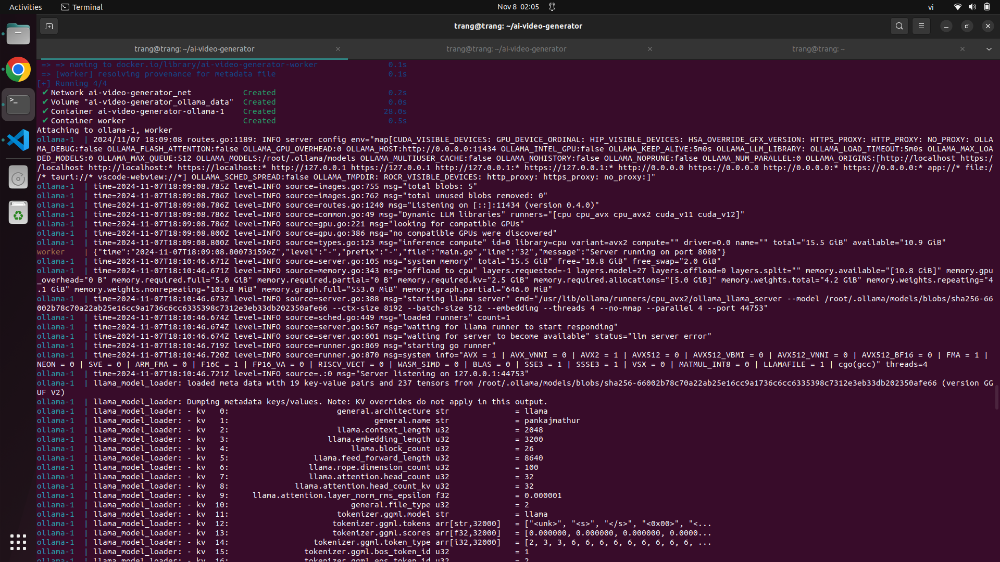
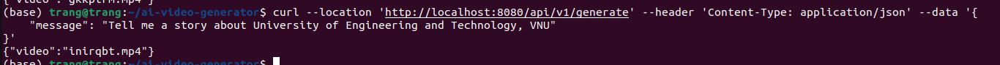
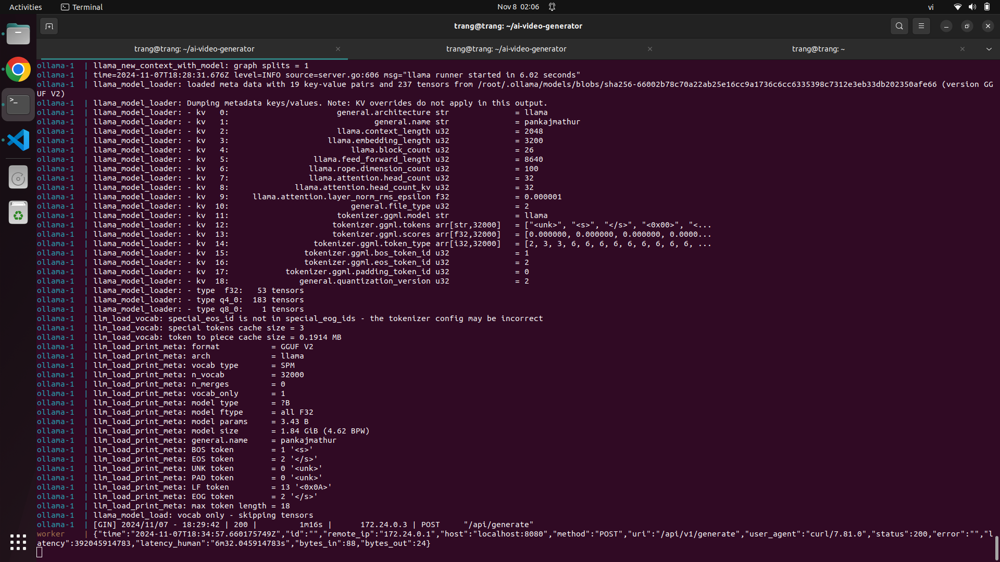
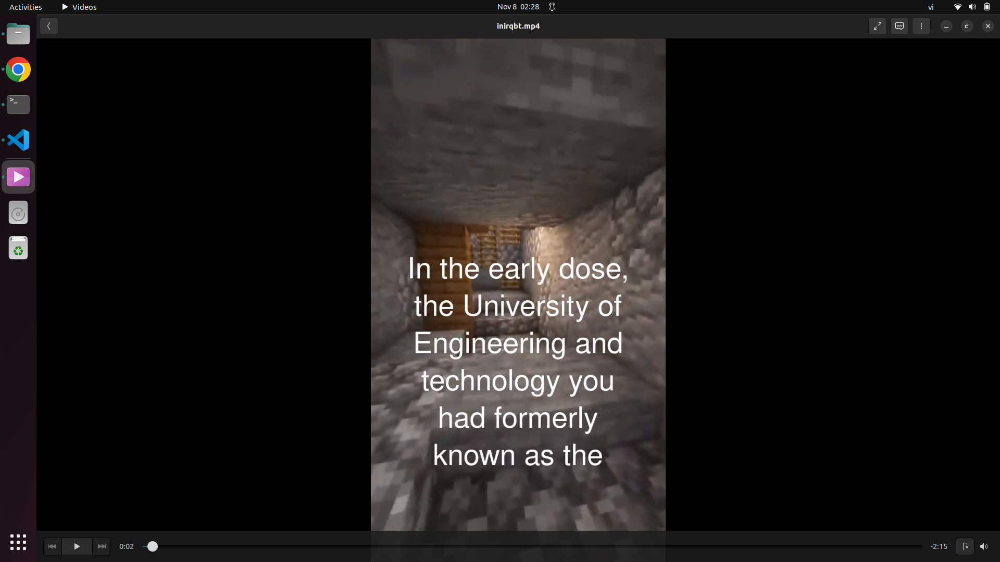

# AIKepco - bài tập cuối khóa
## Giới thiệu bài toán
AI Video story generator: từ một câu lệnh prompt như; "tell me a story about..." AI sẽ sinh ra 1 video kể lại câu chuyên đó

## Cách thức thực hiện
Sử dụng Ollama LLM để tạo ý tưởng văn bản cho video dựa trên các yêu cầu từ người dùng. Nó nhận một yêu cầu từ người dùng và tạo ra một câu chuyện, sau đó chuyển thành âm thanh bằng AI. Tiếp theo, phụ đề được tạo ra từ âm thanh, và cuối cùng, các phụ đề này được kết hợp vào video. Ở đây tập trung vào LLM nhiều hơn là hình ảnh. Vì vậy sau khi tạo phụ đề, em sẽ ghép với video background minecraft có sẵn để tạo thành video kể chuyện

## Demo
Sau khi chạy docker



Gửi API prompt



Hiển thị trên docker: có thể thấy ta có POST method



Sau khi đợi từ 1-2 phút, video sẽ được tạo ra trong thư mục generated. Hình ảnh minh họa video sau khi nhập prompt như trên




## Cách chạy project
Đầu tiên clone và đi tới thư mục
```
git clone https://github.com/Do-Trang/AIKepco
cd AIKepco
```
Chạy project
```
make start
```